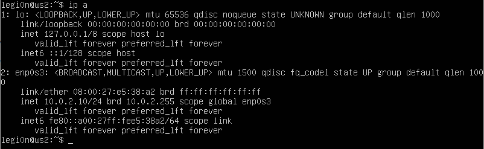
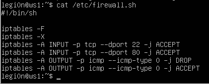
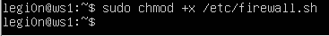
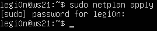
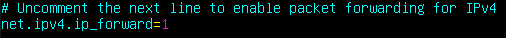
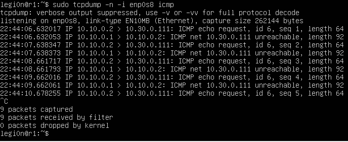
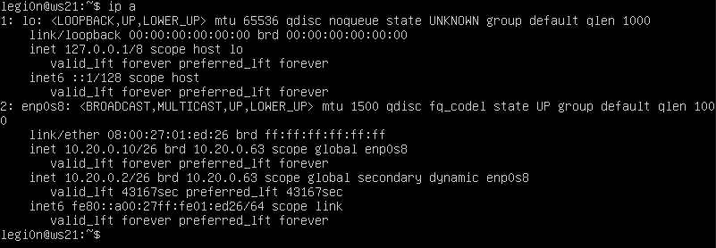

## Part 1. Инструмент **ipcalc**

### 1.1. Сети и маски

+ 192.160.0.0/13
+ 255.255.255.0: /24 11111111.11111111.11111111.00000000
  /15: 255.254.0.0 11111111.11111110.00000000.00000000
  11111111.11111111.11111111.11110000: 255.255.255.240 /28
+ 12.167.38.4/8: min 12.0.0.1 max 12.255.255.254
  12.167.38.4/11111111.11111111.00000000.00000000 min 12.167.0.1 max 12.167.255.254
  12.167.38.4/255.255.254.0 min 12.167.38.1 max 12.167.39.254
  12.167.28.4/4 min 0.0.0.1 max 15.255.255.254

### 1.2. localhost

+ 194.34.23.100 Нет, 127.0.0.2 Да, 127.1.0.1 Да, 128.0.0.1 Нет

### 1.3. Диапазоны и сегменты сетей

+ Частные ip-адреса: 10.0.0.45, 10.10.10.10, 192.168.4.2, 172.16.255.255
  Публичные ip-фдреса: 134.43.0.2, 172.20.250.4, 172.0.2.1, 192.172.0.1, 172.68.0.2, 192.169.168.1

+ 10.10.0.2, 10.10.10.10, 10.10.1.255

## Part 2. Статическая маршрутизация между двумя машинами

+ С помощью команды ip a посмотреть существующие сетевые интерфейсы

Рис. 1. Вывод команды ip a на машине ws1

Рис. 2. Вывод команды ip a на машине ws2

+ Задаем адреса и маски для машин

Рис. 3. Вывод файла etc/netplan/00-installer-config.yaml на машине ws1

Рис. 4. Вывод файла etc/netplan/00-installer-config.yaml на машине ws2

+ Команда netplan apply

Рис. 5. Вывод команды netplan apply на машине ws1

Рис. 6. Вывод команды netplan apply на машине ws2

### 2.1. Добавление статического маршрута вручную

Рис. 7. Вывод команды ip r add 172.24.116.8 def enp0s3 на машине ws1

Рис. 8. Вывод команды ip r add 192.168.100.10 def enp0s3 на машине ws2

Рис. 9. Вывод команды ping 172.24.116.8 -c 5 на машине ws1

Рис. 10. Вывод команды ping 192.168.100.10 -c 5 на машине ws2

### 2.2. Добавление статического маршрута с сохранением

Рис. 11. Вывод файла etc/netplan/00-installer-config.yaml на машине ws1

Рис. 12. Вывод файла etc/netplan/00-installer-config.yaml на машине ws2

Рис. 13. Вывод команды ping 172.24.116.8 -c 5 на машине ws1

Рис. 14. Вывод команды ping 192.168.100.10 -c 5 на машине ws2

## Part 3. Утилита **iperf3**

### 3.1. Скорость соединения

+ 8 Mbps = 1 MB/s
+ 100 MB/s = 100000 Kbps
+ 1 Gbps = 1000 Mbps

### 3.2. Утилита **iperf3**

Рис. 15. Вывод команды iperf3 -s на машине ws1

Рис. 16. Вывод команды iperf3 -c 192.168.100.10 на машине ws2

## Part 4. Сетевой экран

### 4.1. Утилита **iptables**

Рис. 17. Вывод файла /etc/firewall.sh на машине ws1

Рис. 18. Вывод файла /etc/firewall.sh на машине ws2

Рис. 19. Вывод команды chmod +x /etc/firewall.sh на машине ws1

Рис. 20. Вывод команды chmod +x /etc/firewall.sh на машине ws2

Рис. 21. Вывод команды /etc/firewall.sh на машине ws1

Рис. 22. Вывод команды /etc/firewall.sh на машине ws2

+ Разница в стратегиях заключается в порядке добавления правил в список. При наступлении события будет применено правило, которое было добавлено раньше.

### 4.2. Утилита **nmap**

Рис. 23. Вывод команды ping 172.24.116.8 -c 5 на машине ws1

Рис. 24. Вывод команды ping 192.168.100.10 -c 5 на машине ws2

Рис. 25. Вывод команды nmap 192.168.100.10 на машине ws2

## Part 5. Статическая маршрутизация сети

### 5.1. Настройка адресов машин

Рис. 26. Вывод файла etc/netplan/00-installer-config.yaml на машине ws11

Рис. 27. Вывод файла etc/netplan/00-installer-config.yaml на машине ws21

Рис. 28. Вывод файла etc/netplan/00-installer-config.yaml на машине ws22

Рис. 29. Вывод файла etc/netplan/00-installer-config.yaml на машине r1

Рис. 30. Вывод файла etc/netplan/00-installer-config.yaml на машине r2

Рис. 31. Вывод команды netplan apply на машине ws11

Рис. 32. Вывод команды ip -4 a на машине ws11

Рис. 33. Вывод команды netplan apply на машине ws21

Рис. 34. Вывод команды ip -4 a на машине ws21

Рис. 35. Вывод команды netplan apply на машине ws22

Рис. 36. Вывод команды ip -4 a на машине ws22

Рис. 37. Вывод команды netplan apply на машине r1

Рис. 38. Вывод команды ip -4 a на машине r1

Рис. 39. Вывод команды netplan apply на машине r2

Рис. 40. Вывод команды ip -4 a на машине r2

Рис. 41. Вывод команды ping 10.20.0.20 -c 5 на машине ws21

Рис. 42. Вывод команды ping 10.10.0.1 -c 5 на машине ws11

### 5.2. Включение переадресации IP-адресов.

Рис. 43. Вывод команды sysctl -w net.ipv4.ip_forward=1 на машине r1

Рис. 44. Вывод команды sysctl -w net.ipv4.ip_forward=1 на машине r2

Рис. 45. Разкомментированная строка net.ipv4.ip_forward=1 в файле /etc/sysctl.conf на машине r1

Рис. 46. Разкомментированная строка net.ipv4.ip_forward=1 в файле /etc/sysctl.conf на машине r2

### 5.3. Установка маршрута по-умолчанию

Рис. 47. Вывод файла etc/netplan/00-installer-config.yaml на машине ws11

Рис. 48. Вывод файла etc/netplan/00-installer-config.yaml на машине ws21

Рис. 49. Вывод файла etc/netplan/00-installer-config.yaml на машине ws22

Рис. 50. Вывод команды ip r на машине ws11

Рис. 51. Вывод команды ip r на машине ws21

Рис. 52. Вывод команды ip r на машине ws22

Рис. 53. Вывод команды tcpdump -tn -i enp0s9 на машине r2

### 5.4. Добавление статических маршрутов

Рис. 54. Вывод файла etc/netplan/00-installer-config.yaml на машине r1

Рис. 55. Вывод файла etc/netplan/00-installer-config.yaml на машине r2

Рис. 56. Вывод команды ip r на машине r1

Рис. 57. Вывод команды ip r на машине r2

Рис. 56. Вывод команды ip r list 10.10.0.0/18 на машине ws11

Рис. 57. Вывод команды ip r list 0.0.0.0/0 на машине ws11

+ Для адреса 10.10.0.0/18 ранее был настроен статический маршрут, по-этому при запросе команды вывода таблицы маршрутизации выдается маршрут отличный от маршрута по-умолчанию.

### 5.5. Построение списка маршрутизаторов

Рис. 58. Вывод команды traceroute 10.20.0.10 на машине ws11

Рис. 59. Вывод команды tcpdump -tnv -i enp0s8 на машине r1 часть 1

Рис. 60. Вывод команды tcpdump -tnv -i enp0s8 на машине r1 часть 2

Рис. 61. Вывод команды tcpdump -tnv -i enp0s8 на машине r1 часть 3

+ Команда traceroute отправляет эхо-сообщение с постепенно увеличивающимся TTL (Time To Live). Каждый маршрутизатор обязан уменьшить данное значение на 1 и когда значение TTL становится равно 0, маршрутизатор посылает ответ ICMP Time Exceeded. На рисунке 59 можно заметить, что первые три сообщения имеют значение TTL равное 1, а 4 сообщение - 2. Если обратить внимание на сообщения с 5 по 8, то можно заметить, что это ответ маршрутизаторов из-за достижения TTL значения равного 0. 5, 6, 7 сообщение - ответ маршрутизатора по адресу 10.10.0.1(r1), а 8 сообщение - ответ маршрутизатора 10.100.0.12(r2). Начиная со значения TTL равное 3 ответ становится другой (это можно наблюдать на рисунке 60). Это означает, что наш запрос достиг нужного адреса. Такми образом, увеличивая значение TTL, мы можем получить ответ от всех машин, которые расположены по маршруту до целевой машины.

### 5.6. Использование протокола ICMP при маршрутизации

Рис. 62. Вывод команды ping 10.30.0.111 -c 5 на машине ws11

Рис. 63. Вывод команды tcpdump -n -i enp0s8 icmp на машине r1

## Part 6. Динамическая настройка IP с помощью **DHCP**

Рис. 64. Вывод файла /etc/dhcp/dhcp.conf на машине r2

Рис. 65. Вывод файла /etc/resolv.conf на машине r2

Рис. 66. Вывод команды systemctl restart isc-dhcp-server на машине r2

Рис. 67. Вывод команды ip a на машине ws21

Рис. 68. Вывод команды ping 10.20.0.20 -c 5 на машине ws21

Рис. 68. Вывод файла etc/netplan/00-installer-config.yaml на машине ws11

Рис. 64. Вывод файла /etc/dhcp/dhcp.conf на машине r1

Рис. 65. Вывод файла /etc/resolv.conf на машине r1

Рис. 66. Вывод команды systemctl restart isc-dhcp-server на машине r1

Рис. 67. Вывод команды ip a на машине ws11

Рис. 68. Вывод команды ping 10.20.0.20 -c 5 на машине ws11

Рис. 69. ip адрес на машине ws21 до обновления ip адреса

Рис. 70. ip адрес на машине ws21 после обновления ip адреса

+ Для обновления ip адреса использовал две команды: sudo dhclient -r enp0s8 помогает освободить текущий ip адрес и sudo dhclient enp0s8 для получения нового ip адреса на интерфейс enp0s8.

## Part 7. **NAT**

Рис. 71. Вывод файла /etc/apache2/ports.conf на машине r1

Рис. 72. Вывод команды service apache2 start на машине r1

Рис. 73. Вывод файла /etc/apache2/ports.conf на машине ws22

Рис. 74. Вывод команды service apache2 start на машине ws22

Рис. 75. Вывод команды ping 10.20.0.20 -c 5 на машине r1

Рис. 76. Вывод команды ping 10.20.0.20 -c 5 на машине r1 после добавления 4 правила

Рис. 77. Вывод файла /etc/firewall.sh на машине r2

Рис. 78. Вывод команды telnet 10.100.0.11 80 на манише ws22

Рис. 79. Вывод команды telnet 10.100.0.12 8080 на манише r1

## Part 8. Дополнительно. Знакомство с **SSH Tunnels**

+ Изменить файл /etc/apache2/ports.conf можно при помощи любого текстового редактора. Я воспользовался командой sudo vim /etc/apache2/ports.conf.

Рис. 80. Вывод файла /etc/apache2/ports.conf на машине ws22

+ Доступ к ws22 c ws21 при помощи Local TCP forwarding можно получить командой ssh -L 9999:localhost:80 <имя_пользователя>@10.20.0.20 -p 2022. Ключ -p 2022 нужен т.к. ssh сервер настроен не на 22 порт, а на порт 2022.
+ Протестировать соединение можно набрав команду telnet 127.0.0.1 9999 после перехода в другой терминал.

Рис. 81. Результат команды ssh -L 9999:localhost:80 legi0n@10.20.0.20 -p 2022 на машине ws21

Рис. 82. Результат команды telnet 127.0.0.1 9999 на машине ws21

+ Доступ к ws22 c ws11 при помощи Remote TCP forwarding можно получить набрав на машине ws22 командy ssh -R 9999:localhost:80 <имя_пользователя>@10.10.0.6 -p 2022. Ключ -p 2022 нужен т.к. ssh сервер настроен не на 22 порт, а на порт 2022.
+ Протестировать соединение можно набрав команду telnet 127.0.0.1 9999 на машине sw11.

Рис. 83. Результат команды ssh -L 9999:localhost:80 legi0n@10.20.0.20 -p 2022 на машине ws22

Рис. 84. Результат команды telnet 127.0.0.1 9999 на машине ws11
